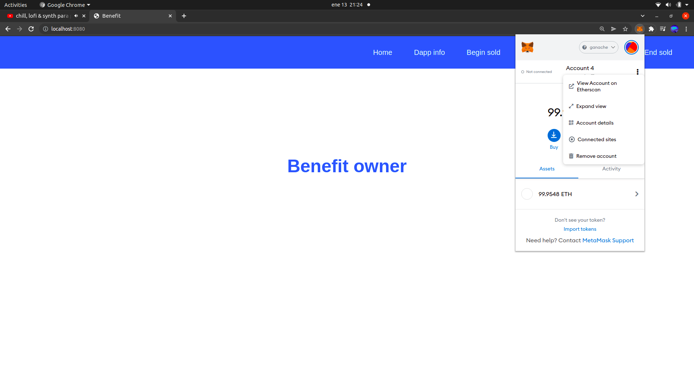

# Benefit

## Descripción:

Benefit es una aplicación creada para ser desplegada en la cadena de bloques de Ethereum y su proposito es el de crear una interfaz que nos permita comprar el token nativo ERC-20 del contrato (BNF) depositando ETH.  
La idea principal es que los fondos almacenados en el contrato pueden ser retirados por el propietario del mismo para luego reingresarlos con beneficios añadidos que aumentarían el valor de los tokens. En una situación así, el usuario podría cambiar sus tokens por una cantidad de ETH superior a la que ingresó.
En caso de no ingresarse ganancias, el usuario podría vender sus tokens al precio de compra ya que el propietario del contrato deposita un soporte a este efecto.
La aplicación permite, además, el intercambio de tokens entre usuarios y la consulta en todo momento de la información del contrato.

## Clonar el repositorio:

Copiaremos el repositorio y lo clonaremos utilizando el comando "git clone" seguido del repositorio en el directorio que deseemos.

## Instalación de paquetes:

### NodeJs: 

Nos permite ejecutar código escrito en Javascript del lado del servidor.  
Información en: https://nodejs.org/en/

### Npm: 

Es un gestor de paquetes para NodeJs.   
Información en: https://nodejs.org/es/download/package-manager/

### Nvm: 

Nos permite cambiar con facilidad nuestra versión de NodeJs.  
Si somos usuarios de Ubuntu podemos emplear el siguiente enlace para instalar Node, Npm y Nvm: https://www.hostinger.es/tutoriales/instalar-node-js-ubuntu/

### Truffle: 

Es un entorno de desarrollo que nos ayuda a crear aplicaciones descentralizadas.  
Para instalarlo ejecutaremos el comando: npm i -g truffle.
Para más información visitar: https://blog.desdelinux.net/truffle-framework-herramientas-codigo-abierto-blockchain/?utm_source=dlvr.it&utm_medium=facebook

### Ganache: 

Descargaremos Ganache para nuestro sistema operativo.  
Debemos acudir al siguiente enlace: https://www.trufflesuite.com/ganache

### Metamask: 

Se trata de una billetera que custodia claves privadas de la cadena de bloques de Ethereun además de servir como intermediario entre nuestro sitio web y la blockchain y otras muchas funcionalidades.  
Quedará instalada como una extensión de nuestro navegador.  
Enlace de descarga en: https://metamask.io/

### Instalar paquetes dentro del proyecto con npm:  

El proyecto consta de tres directorios: benefit-api, benefit-customer y benefit-owner. Debemos entrar en cada uno de ellos y ejecutar el comando "npm i" para instalar los paquetes correspondientes.

## Primeros pasos:

### Abrir Ganache:

Abriremos Ganache , seleccionaremos la opción "quick start" para empezar a trabajar y, de esta manera, empezará a ejecutarse nuestro entorno de desarrollo simulando la red de Ethereum.

### Desplegar nuestro proyecto en la red de Ganache: 

Para ello, nos dirigiremos al directorio "benefit-api" de nuestro proyecto y ejecutaremos el comando "truffle compile". Este comando compilará los contratos inteligentes dejándolos listos para el despliegue.

El siguiente paso, una vez la compilación se haya realizado con éxito, será ejecutar, en este mismo directorio, el comando "truffle migrate" el cual desplegará nuestros contratos inteligentes en Ganache.

Vemos como, en la ventana izquierda de la terminal de comandos, aparecen dos transacciones, la primera con un hash que termina en 4838 y la segunga con otro que termina el 30c6.

Para comprobar que el proceso se ha realizado correctamente nos dirigiremos a Ganache y, en la barra de navegación superior, haremos click en "transactions". Deberan aparecernos dos transacciones con el marcador "contract creation cuyo hash coincidirá con los anteriores.

### Abrir Metamask y crear una cuenta:

Para que el cliente pueda interactuar con Ganache será necesario abrir Metamask y crear una billetera. En el siguiente enlace podemos encontrar un tutorial que nos muestra el proceso: https://www.youtube.com/watch?v=l_1OBHB3Lc0&t=252s

Cuando terminemos el proceso podremos ver nuestra billetera de Metamask.

### Agregar a Metamask nuestra red de Ganache:

Metamask puede trabajar con varias redes. Si queremos trabajar con esta aplicación tendrá que ser en una red de pruebas como es la de Ganache. Para ello, tendremos que agregarla a Metamask.  
Primeramente, nos dirigiremos a Metamask y haremos click en la parte superior donde nos dice "Red principal de Ethereum" o "Ethereum Mainnet".

Se nos desplegará un menú y allí seleccionaremos "Add Network" para introducir una nueva red.  
Seguidamente, le daremos a la red el nombre que queramos y en la URL le pasaremos la de nuestro servidor local de Ganache: HTTP://127.0.0.1:7545  
En el id pondremos un número cualquiera, ya que se trata de un proyecto de desarrollo, le daremos a guardar y nos dirá que el id no es válido sugiriéndonos otro a su vez. Pondremos el id que nos propone y guardaremos sin hacer caso del aviso que aparece en color rojo.

Ya tenemos Metamask conectado a la red de Ganache.
Las cuentas siguen marcando 0 ETH porque en la red de Ganache este es el saldo que tienen asignado. Las cuentas creadas por defecto en Ganache tienen todas 100 ETH de primeras pero todavía las hemos importado en nuestra billetera Metamask.

### Importar cuentas en Metamask:

Para trabajar con la aplicación necesitaremos cuentas que se encuentren en Ganache. Nos dirigiremos al apartado "Accounts" dentro de la barra de navegación de Ganache y allí nos aparecerán las cuentas de nuestro servidor. Como ya hemos dicho anteriormente cada una tiene por defecto un saldo inicial de 100 ETH.

Si queremos importar una cuenta necesitaremos la clave privada. Para obtener la clave privada haremos click en el símbolo de llave de la parte derecha. Una vez hecho esto copiaremos la clave privada en el portapapeles.
Vamos a seleccionar la cuenta que contiene 99.95 ETH. La razón de que no contenga los 100 ETH iniciales es que esta es la cuenta que ha desplegado el contrato, motivo por el cual se le ha descontado el gas correspondiente. 

El siguiente paso es dirigirnos a Metamask. En la parte superior derecha desplegaremos el menú y haremos click en "importar cuenta".

Se nos abrirá un input en el cual deberemos escribir nuestra clave privada.

La cuenta ya estará importada.

Para probar la aplicación sería recomendable hacer lo mismo con varias cuentas de las que nos ha generado Ganache.

### Arrancar el front-end:

Para ello nos dirigiremos al directorio "benefit-owner" y ejecutaremos el comando "npm start". Esto hará que se arranque la aplicación en el puerto conrrespondiente y nuestro navegador la ejecute automáticamente.
Cuando el navegador abra la aplicación veremos el "home" del owner.

Haremos lo mismo en el directorio "benefit-customer".
Igualmente, al final del proceso, el navegador deberá mostrarnos el home del cliente.

### Conectar la aplicación con Metamask:  
Para ello nos ubicaremos en la pestaña del navegador en la que se encuentra cualquiera de las dos aplicaciones que hemos arrancado.  
Una vez allí, abriremos la extensión de Metamask y entraremos en nuestra cuenta.

Una vez dentro, abriremos el menú de la cuenta y entraremos en "sitios conectados".

El siguiente paso será conectar manualmente.

Después, tendremos que elegir la cuenta correspondiente.

Para terminar, pulsaremos en conectar.

Ahora, en el apartado de "sitios conectados" debería aparecernos la url local de nuestra aplicación de front-end.

Seguiremos los mismos pasos en la otra aplicación.

## Cómo utilizar la aplicación:

### Habilitar la venta de tokens en el contrato inteligente:

En primer lugar debemos dirigirnos a Benefit Owner, que es la aplicación del propietario o administrador del contrato.
Antes de nada, aclarar que la cuenta con la que hemos desplegado es la propietaria del contrato con lo cual, es la unica dirección autorizada a utilizar es parte de owner. Durate las explicaciones la dirección del owner cambiará ya que en ciertas ocasiones, debido a problemas técnicos, habra sido necesario crear otro entorno de desarrollo con redes nuevas.
Una vez allí nos encontraremos una con el "home" o portada de la dapp y una barra de navegación con varios apartados.

#### Estado inicial del contrato:

Seguidamente, encontraremos Dapp Info, que nos permite ver la información de nuestro contrato.

De momento tan solo nos enseñará que la aplicación tiene 100 tokens existentes pero ninguno está disponible para su compra, por lo que el apartado "available tokens" marca 0. 
Los fondos de nuestro contrato todavía son 0 ETH ya que ninguna cuenta ha depositado fondos en el.
El soporte o respaldo logícamente también es 0 ya que si el contrato no tiene fondos nada puede haber como respaldo.
El precio del token también está a 0 ya que la venta no está habilitada.

#### Depositar soporte y habilitar la compra de tokens:

Begin sold nos presenta un input que nos permitirá añadir al contrato el soporte (en weys) y hacer que se creen automáticamente los tokens para que queden a disponibilidad del usuario.
En este caso vamos a añadir 1 ETH (al introducirlo en weys serán 1000000000000000000 weys).

Una vez pulsemos en confirmar, se nos abrirá automáticamente nuestra billetera de Metamask para ejecutar la operación.

Si nos deslizamos hacia abajo con la barra de desplazamiento de la billetera veremos un botón de confirmación. Lo pulsaremos para ejecutar la transacción tras lo cual nos aparecerá una ventana emergente que nos indica que la operación ha sido exitosa.

Después de depositar los fondos vemos cono el estado del contrato ya ha cambiado.

Ahora sigue habiendo un supply de 100 BNF ya que es el número total de tokens que existen.
El número total de tokens a la venta ha pasado a ser de 100 BNF ya que ahora todos los tokens que alberga el contrato están disponibles para ser comprados por los usuarios.
El balance total son 1 ETH ya que es la cantidad que hemos depositado.
El soporte, cantidad que respalda la dapp para que el usuario siempre pueda recuperar como mínimo su inversión inicial, son los 10 ETH depositados.
El precio del token es de 0.01 ETH que es el fijado como valor inicial. Más adelante hablaremos del criterio que se sigue para fijar el precio del token.