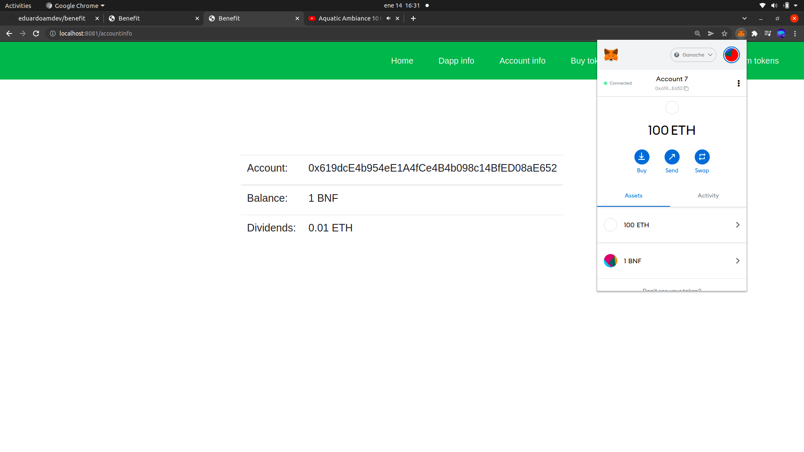

# Benefit

## Descripción:

Benefit es una aplicación creada para ser desplegada en la cadena de bloques de Ethereum y su proposito es el de crear una interfaz que nos permita comprar el token nativo ERC-20 del contrato (BNF) depositando ETH.  
La idea principal es que los fondos depositados por los usuarios dentro del contrato inteligente pueden ser retirados por el propietario del mismo para luego reingresarlos con beneficios añadidos que aumentarían el valor de los tokens ya que este aumenta a medida que más ETH va entrando en el contrato. En una situación así, el usuario podría cambiar sus tokens por una cantidad de ETH superior a la que ingresó.
En caso de no ingresarsen ganancias, el usuario podría vender sus tokens al precio de compra ya que el propietario del contrato deposita un soporte a este efecto.
La aplicación permite, además, el intercambio de tokens entre usuarios y la consulta en todo momento de la información del contrato.

## Clonar el repositorio:

Copiaremos el repositorio y lo clonaremos utilizando el comando "git clone" seguido del repositorio en el directorio que deseemos.

## Instalación de paquetes:

### NodeJs: 

Nos permite ejecutar código escrito en Javascript del lado del servidor.  
Información en: https://nodejs.org/en/

### Npm: 

Es un gestor de paquetes para NodeJs.   
Información en: https://nodejs.org/es/download/package-manager/

### Nvm: 

Nos permite cambiar con facilidad nuestra versión de NodeJs.  
Si somos usuarios de Ubuntu podemos emplear el siguiente enlace para instalar Node, Npm y Nvm: https://www.hostinger.es/tutoriales/instalar-node-js-ubuntu/

### Truffle: 

Es un entorno de desarrollo que nos ayuda a crear aplicaciones descentralizadas.  
Para instalarlo ejecutaremos el comando: npm i -g truffle.
Para más información visitar: https://blog.desdelinux.net/truffle-framework-herramientas-codigo-abierto-blockchain/?utm_source=dlvr.it&utm_medium=facebook

### Ganache: 

Descargaremos Ganache para nuestro sistema operativo.  
Debemos acudir al siguiente enlace: https://www.trufflesuite.com/ganache

### Metamask: 

Se trata de una billetera que custodia claves privadas de la cadena de bloques de Ethereun además de servir como intermediario entre nuestro sitio web y la blockchain y otras muchas funcionalidades.  
Quedará instalada como una extensión de nuestro navegador.  
Enlace de descarga en: https://metamask.io/

### Instalar paquetes dentro del proyecto con npm:  

El proyecto consta de tres directorios: benefit-api, benefit-customer y benefit-owner. Debemos entrar en cada uno de ellos y ejecutar el comando "npm i" para instalar los paquetes correspondientes.

## Primeros pasos:

### Abrir Ganache:

Abriremos Ganache , seleccionaremos la opción "quick start" para empezar a trabajar

De esta manera, empezará a ejecutarse nuestro entorno de desarrollo simulando la red de Ethereum.

### Desplegar nuestro proyecto en la red de Ganache: 

Para ello, nos dirigiremos al directorio "benefit-api" de nuestro proyecto y ejecutaremos el comando "truffle compile". Este comando compilará los contratos inteligentes dejándolos listos para el despliegue.

El siguiente paso, una vez la compilación se haya realizado con éxito, será ejecutar, en este mismo directorio, el comando "truffle migrate" el cual desplegará nuestros contratos inteligentes en Ganache.

Vemos como, en la ventana izquierda de la terminal de comandos, aparecen dos transacciones, la primera con un hash que termina en 4838 y la segunga con otro que termina el 30c6.

Para comprobar que el proceso se ha realizado correctamente nos dirigiremos a Ganache y, en la barra de navegación superior, haremos click en "transactions". Deberan aparecernos dos transacciones con el marcador "contract creation cuyo hash coincidirá con los anteriores.

### Abrir Metamask y crear una cuenta:

Para que el cliente pueda interactuar con Ganache será necesario abrir Metamask y crear una billetera. En el siguiente enlace podemos encontrar un tutorial que nos muestra el proceso: https://www.youtube.com/watch?v=l_1OBHB3Lc0&t=252s

Cuando terminemos el proceso podremos ver nuestra billetera de Metamask.

### Agregar a Metamask nuestra red de Ganache:

Metamask puede trabajar con varias redes. Si queremos trabajar con esta aplicación tendrá que ser en una red de pruebas como es la de Ganache. Para ello, tendremos que agregarla a Metamask.  
Primeramente, nos dirigiremos a Metamask y haremos click en la parte superior donde nos dice "Red principal de Ethereum" o "Ethereum Mainnet".

Se nos desplegará un menú y allí seleccionaremos "Add Network" para introducir una nueva red.  
Seguidamente, le daremos a la red el nombre que queramos y en la URL le pasaremos la de nuestro servidor local de Ganache: HTTP://127.0.0.1:7545  
En el id pondremos un número cualquiera, ya que se trata de un proyecto de desarrollo, le daremos a guardar y nos dirá que el id no es válido sugiriéndonos otro a su vez. Pondremos el id que nos propone y guardaremos sin hacer caso del aviso que aparece en color rojo.

Ya tenemos Metamask conectado a la red de Ganache.
Las cuentas siguen marcando 0 ETH porque en la red de Ganache este es el saldo que tienen asignado. Las cuentas creadas por defecto en Ganache tienen todas 100 ETH de primeras pero todavía las hemos importado en nuestra billetera Metamask.

### Importar cuentas en Metamask:

Para trabajar con la aplicación necesitaremos cuentas que se encuentren en Ganache. Nos dirigiremos al apartado "Accounts" dentro de la barra de navegación de Ganache y allí nos aparecerán las cuentas de nuestro servidor. Como ya hemos dicho anteriormente cada una tiene por defecto un saldo inicial de 100 ETH.

Si queremos importar una cuenta necesitaremos la clave privada. Para obtener la clave privada haremos click en el símbolo de llave de la parte derecha. Una vez hecho esto copiaremos la clave privada en el portapapeles.
Vamos a seleccionar la cuenta que contiene 99.95 ETH. La razón de que no contenga los 100 ETH iniciales es que esta es la cuenta que ha desplegado el contrato, motivo por el cual se le ha descontado el gas correspondiente. 

El siguiente paso es dirigirnos a Metamask. En la parte superior derecha desplegaremos el menú y haremos click en "importar cuenta".

Se nos abrirá un input en el cual deberemos escribir nuestra clave privada.

La cuenta ya estará importada.

Para probar la aplicación sería recomendable hacer lo mismo con varias cuentas de las que nos ha generado Ganache.

### Arrancar el front-end:

Para ello nos dirigiremos al directorio "benefit-owner" y ejecutaremos el comando "npm start". Esto hará que se arranque la aplicación en el puerto conrrespondiente y nuestro navegador la ejecute automáticamente.
Cuando el navegador abra la aplicación veremos el "home" del owner.

### Conectar la aplicación con Metamask:  
Para ello nos ubicaremos en la pestaña del navegador en la aplicación del owner que acabamos de arrancar.  
Una vez allí, abriremos la extensión de Metamask y entraremos en nuestra cuenta.

Una vez dentro, abriremos el menú de la cuenta y entraremos en "sitios conectados".

El siguiente paso será conectar manualmente.

Después, tendremos que elegir la cuenta correspondiente.

Para terminar, pulsaremos en conectar.

Ahora, en el apartado de "sitios conectados" debería aparecernos la url local de nuestra aplicación de front-end.

Seguiremos los mismos pasos en la otra aplicación.

## Cómo utilizar la aplicación:

### Habilitar la venta de tokens en el contrato inteligente:

En primer lugar debemos dirigirnos a Benefit Owner, que es la aplicación del propietario o administrador del contrato.
Antes de nada, aclarar que la cuenta con la que hemos desplegado es la propietaria del contrato con lo cual, es la unica dirección autorizada a utilizar es parte de owner. Durate las explicaciones la dirección del owner cambiará ya que en ciertas ocasiones, debido a problemas técnicos, habra sido necesario crear otro entorno de desarrollo con redes nuevas.
Una vez allí nos encontraremos una con el "home" o portada de la dapp y una barra de navegación con varios apartados.

#### Estado inicial del contrato:

Seguidamente, encontraremos Dapp Info, que nos permite ver la información de nuestro contrato.

De momento tan solo nos enseñará que la aplicación tiene 100 tokens existentes pero ninguno está disponible para su compra, por lo que el apartado "available tokens" marca 0. 
Los fondos de nuestro contrato todavía son 0 ETH ya que ninguna cuenta ha depositado fondos en el.
El soporte o respaldo logícamente también es 0 ya que si el contrato no tiene fondos nada puede haber como respaldo.
El precio del token también está a 0 ya que la venta no está habilitada.

#### Depositar soporte y habilitar la compra de tokens:

Begin sold nos presenta un input que nos permitirá añadir al contrato el soporte (en weys) y hacer que se creen automáticamente los tokens para que queden a disponibilidad del usuario.
En este caso vamos a añadir 1 ETH (al introducirlo en weys serán 1000000000000000000 weys).

Una vez pulsemos en confirmar, se nos abrirá automáticamente nuestra billetera de Metamask para ejecutar la operación.

Si nos deslizamos hacia abajo con la barra de desplazamiento de la billetera veremos un botón de confirmación. Lo pulsaremos para ejecutar la transacción tras lo cual nos aparecerá una ventana emergente que nos indica que la operación ha sido exitosa.

Después de depositar los fondos vemos cono el estado del contrato ya ha cambiado.

Ahora sigue habiendo un supply de 100 BNF ya que es el número total de tokens que existen.
El número total de tokens a la venta ha pasado a ser de 100 BNF ya que ahora todos los tokens que alberga el contrato están disponibles para ser comprados por los usuarios.
El balance total son 1 ETH ya que es la cantidad que hemos depositado.
El soporte, cantidad que respalda la dapp para que el usuario siempre pueda recuperar como mínimo su inversión inicial, son los 10 ETH depositados.
El precio del token es de 0.01 ETH que es el fijado como valor inicial. Más adelante hablaremos del criterio que se sigue para fijar el precio del token.
Si ahora entramos en Ganache veremos como al saldo de la cuenta de alministrador (la primera del listado) se le ha descontado la cantidad correspondiente.

### Comprar nuestros primeros tokens con una cuenta de cliente:

En primer lugar abriremos la aplicación del cliente con nuestro navegador.

#### Abrir la aplicación del cliente e importar una cuenta de usuario:

Abriremos nuestra wallet de Metamask e importaremos una cuenta distinta de la del owner de entre todas las que tenemos en Ganache (el owner puede operar también pero vamos a simular que llega a la dapp un usuario externo). Para ello conectaremos la wallet del cliente de la misma manera que hicimos con la del owner.

#### Conectar la Metamask a nuestra aplicación:

En primer lugar, seleccionaremos la cuenta del cliente en nuestra billetera de Metamask. Vemos que esta cuenta tiene los 100 ETH iniciales puesto que nunca se ha usado.

Una vez hecho esto conectamos Metamask con nuestra aplicación como ya hemos hecho en la del owner.
Ahora, podemos revisar el apartado dapp info para ver que nos aparece la misma información que al owner.

Por otro lado, entrando en account info podremos consultar los dividendos que recibiríamos al retirar la inversión (expresados en ETH ya que va a ser el activo empleado para el pago) y el saldo en BNF de nuestra propia cuenta.

#### Comprar tokens

Vamos a comprar 2 tokens BNF. Para ello entraremos en el apartado "buy tokens" y rellenaremos el input con la cantidad de BNF que deseamos adquirir.

Si confirmamos, nos aparecerá la ventana emergente con nuestra wallet indicándonos el desembolso correspondiente, en este caso 0.02 ETH puesto el precio del token es de 0.01 ETH.

Seguidamente, nos aparecerá una ventana emergente informando de que la transacción ha sido realizada correctamente.

Ahora en account info figura un saldo de 2 BNF y unos dividendos generados de 0.02 ETH. Estos dividendos se incrementarán según pase el tiempo ya que la idea es que el owner opere con los fondos no contenidos en el respaldo para después reingresar lo retirado junto con los beneficios obtenidos.

Del mismo modo, Metamask también refleja esa transacción y además, incluye en nuestra lista de assets el token BNF con la cantidad correspondiente.

También podemos ver, entrando en dapp info, como la situación del contrato inteligente ha cambiado.

El supply siempre va a ser de 100 BNF puesto que es la cantidad total de tokens existentes.
Los tokens disponibles (available tokens) han pasado a ser 98 BNF ya que hemos vendido 2 BNF y estos se han restado de los 100 BNF iniciales que albergaba el contrato.
Al balance del contrato (contract balance) se le han sumado los 0.02 ETH depositados por el usuario para la compra de tokens.
El soporte sigue siendo de 1 ETH.
Y el precio del token no ha variado. Para que este precio varíe es necesario que el usuario introduzca más fondos.

### Transferir tokens a otra cuenta:

Vamos a partir de que hemos hecho la compra de 2 BNF con una cuenta en el apartado anterior y queremos transferir 1 BNF a otra que tiene 0 BNF.
A continuación mostramos la situación de la cuenta que va a recibir esta transferencia.

Para efectuar la transferencia, cambiamos a la cuenta con la que hicimos la compra y entramos en transfer tokens. Una vez dentro pondremos tanto la dirección de destino como la cantidad de BNF a enviar.

Si confirmamos nos aparecerá la ventana emergente de Metamask indicándonos esta vez que se va a transferir 1 BNF a la dirección de destino.

Después veremos la correspondiente ventana emergente confirmando la nueva trasacción.

Vemos como el saldo de esta cuenta se ha reducido a 1 BNF y en consecuencia, sus dividendos han bajado a 0.01 ETH.

También podemos ver como el balance de la cuenta receptora ha pasado de 0 BNF a 1 BNF así como sus dividendos ahora serían de 0.01 ETH.

Me gustaría mencionar un detalle importante antes de continuar y es que, si abrimos la billetera de Metamask de la cuenta que ha recibido la transacción veremos como el token BNF no figura en el listado de assets.

Esto no significa que haya habido algún problema ya que aunque los tokens no estén listados se encuentran igualmente asignados a nuestra cuenta.
De todas formas, si queremos listar el token porque deseamos tenerlo a la vista necesitaremos la dirección del contrato inteligente para que Metamask lo pueda encontrar dentro de la red. Encontraremos esta dirección en Ganache o en nuestra consola de comandos ya que se nos mostró durante el despliegue.
Esta dirección la copiaremos en nuestro portapapeles.

Una vez copiada la dirección nos dirigiremos a nuestra billetera de Metamask y seleccionaremos en la parte de abajo la opción importar tokens.
Una vez hecho esto, accederemos a un formulario que contiene un campo con el label "token contract address". Aquí será donde pegaremos la dirección de nuestro contrato para que, de manera automática, se nos rellenen todos los demás campos.

Ahora ya sólo queda confirmar y nuestro token habrá quedado listado.

### Extraer el ETH que no forme parte del soporte (esta labor corresponde únicamente al propietario del contrato):

Ahora vamos a ponernos en otra situación.
Tenemos una cuenta de propietario y dos cuentas de cliente, una con 10 BNF y otra con 5 BNF.
Como consecuencia de las compras de estos usuarios la situación del contrato es la siguiente.

Ahora vamos a fijarnos en el balance, que es de 1.15 ETH. Como el soporte es de 1 ETH podremos extraer 0.15 ETH para operar.
Con esta idea, desde la aplicación del owner y con la cuenta del mismo, vamos a dirigirnos al apartado extract ether y vamos a rellenar el input con la cantidad de weys (recordamos que debemos trabajar en weys y que un wey es igual a diez elevado a la menos dieciocho ether) que queremos extraer.

Ahora la situación del contrato pasa a ser la siguiente.

Vemos que se han vendido quince tokens pero que, al retirar el ether, el balance ha pasado de 1.15 ETH a 1 ETH.
Gracias a que este soporte se encuentra en el contrato los usuarios podrán recuperar su inversión en cualquier momento aunque el propietario haya retirado fondos.

### Ingresar ETH (esta labor corresponde únicamente al propietario del contrato):

Pongamos que el owner, que había retirado 0.15 ETH, ha operado con los activos y los ha multiplicado por dos obteniendo, de esta manera 0.3 ETH. Podría ser un buen momento para ingresar los beneficios.
Para ello, entraremos, dentro de la aplicación del owner, en credit ether. Una vez allí, rellenaremos el input con la cantidad de weys que queremos ingresar, en este caso, 300000000000000000.

Tras confirmar la operación iremos a revisar la nueva situación del contrato.

Vemos que al haber doblado el owner la cantidad de ether que tenemos en el contrato (al margen del soporte) también se han doblado tanto los dividendos que se obtienen al salir (0.02 ETH por token frente al 0.01 ETH que se obtenía anteriormente) como el precio del token (que también ha pasado de 0.01 ETH a 0.02 ETH).

### Retirar dividendos:

Siguiendo en el contexto del anterior apartado, vamos a suponer que uno de los usuarios de la dapp, viendo que los dividendos se han doblado, vender su token y recoger beneficios.
Utilizaremos como ejemplo, un usuario que tiene 10 tokens.

En este caso la suma que este usuario obtendrá si vende sus token será el doble de la inversión que hizo. Como la inversión fue de 1 ETH (diez tokens BNF) ahora obtendrá 2 ETH.

Para ello tiene que entrar, dentro de la aplicación del usuario en redeem tokens para una vez allí introducir la cantidad de tokens que desea devolver al contrato. En este caso vamos a devolver los 10 BNF.

Si después de confirmar la transacción entramos en account info veremos como esta cuenta tiene 0 BNF y, por lo tanto, 0 ETH que recoger como dividendos. Por contra, si abrimos Metamask nos aparecerá que su saldo ha aumentado como consecuencia de la recogida de dividendos (ahora el balance de esta cuenta supera los 100 ETH iniciales).

### Liquidación del contrato:

Dentro de la aplicación del propietario, este tiene una opción para liquidar el contrato con lo cual, los fondos que el mismo albergara pasarían a su cuenta y se suspendería la venta de tokens.

## Tecnologías empleadas:

### Ganache:

Ganache es un entorno de desarrollo que nos proporciona una red de pruebas para desarrollo de aplicaciones descentralizadas en el que podemos desplegar contratos inteligentes, interactuar con Metamask y crear cuentas entre otras funcionalidades.

### Truffle:

Truffle es un entorno de desarrollo que nos proporciona un conjunto de herramientas para desarrollar en la red de Ethereum de una manera más amigable.

### Metamask:

Metamask es la wallet que estamos empleando y que hace de intermediario entre nuestro front-end y la cadena de bloques o, en este caso, el entorno generado por Ganache.

### Web3:

Este paquete de software consiste en una colección de librerías que nos permiten interactuar con nodos de la red de Ethereum.

### React:

React es una biblioteca de Javascript que sirve para crear interfaces de usuario de una manera sencilla y basándonos en la elaboración de componentes.

## ¿Qué me ha aportado este proyecto?:

Este proyecto me ha servido para introducirme en el desarrollo en blockchain.
He elegido Solidity debido a la gran cantidad de documentación existente y a que ya hay creado un conjunto de entornos de desarrollo que nos facilitan el despliegue y la utilización de los contratos inteligentes.
La verdad es que introducirme en Solidity ha sido una experiencia. Para un desarrollador MERN como yo retirar una parte de las tecnologías, ya que NodeJS y MongoDB no han sido empleadas en este proyecto, para sustituirlas por otras nuevas como Solidity y Ganache supone un esfuerzo por adaptarse al nuevo lenguaje y aprender a usar las herramientas de las que se disponen. Esta es una situación a la que creo que combiene acostumbrarse ya que el mundo del desarrollo web va cambiando, las tecnologías se actualizan o se remplazan por otras nuevas y a nosotros nos toca adaptarnos en este entorno.
Por lo demás, estoy satisfecho de haberme introducido en el desarrollo en blockchain ya que considero que es un sector con futuro y con gran capacidad de expansión.